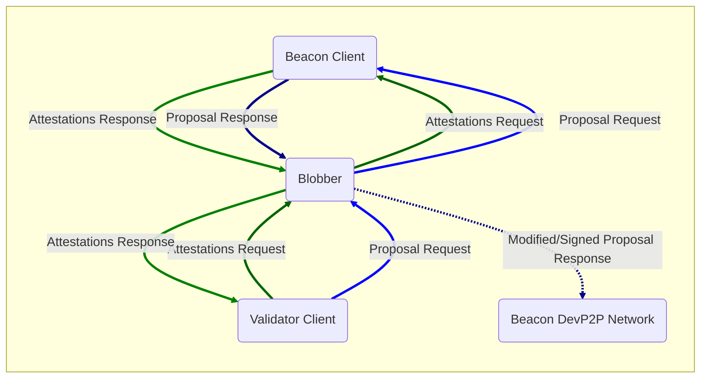

# Beacon Chain DevP2P Blob Testing Proxy

Testing tool that sits as a proxy between the beacon and validator clients in order to intercept proposals, and then modify, delay, conceal or corrupt the blobs included in the proposal, which are then relayed to all the beacon clients via the DevP2P network.

