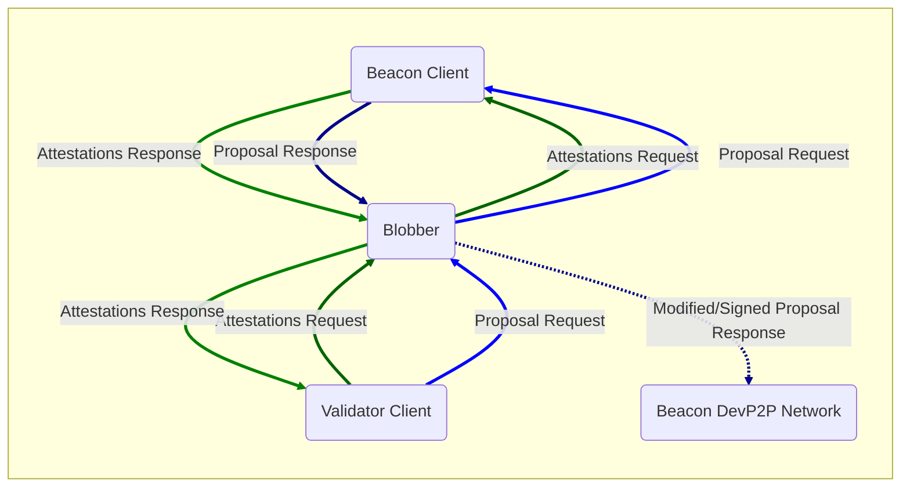

# Beacon Chain DevP2P Blob Testing Proxy


## !! WARNING !!

Running some of the actions included in this tool will get a validator **SLASHED**.

Please exercise caution when using this tool and never use it on Mainnet!

## Description

Testing tool that sits as a proxy between the beacon and validator clients in order to intercept proposals, and then modify, delay, conceal or corrupt the blobs included in the proposal, which are then relayed to all the beacon clients via the DevP2P network.



## Installation

### Using Make (recommended)
```bash
git clone https://github.com/marioevz/blobber.git
cd blobber
make build
./blobber --help
```

### Manual build
```bash
git clone https://github.com/marioevz/blobber.git
cd blobber
go build -o blobber ./cmd
./blobber --help
```

Note: The Make build will automatically include git commit hash and build date in the binary.

### Getting Help

To see all available command-line options and usage examples:

```bash
./blobber --help
# or
./blobber -h
```

## Use with Docker

```bash
docker run -it ethpandaops/blobber:latest --help
```

## Configuration

### Beacon Node Configuration
The blobber requires at least one consensus client in Beacon Node + Validator Client configuration, and the `--cl` flag must be provided to point to the Beacon Node REST API endpoint:

```bash
--cl http://beacon_node_1:4000/ --cl http://beacon_node_2:4000/ ...
```

The Beacon Node endpoint will be used to relay all Validator Client requests and intercept proposals, and also to obtain the client's ENR, which the blobber will use to connect to the client via devp2p.

The validator client must be then configured to connect to the blobber instead of the Beacon Node, starting at port 20,000 (by default) and increasing by 1 for each Beacon Node configured using the `--cl` flag.

### Validator Keys

In order to produce block signatures, correct and equivocating, the blobber needs the validator keys of the validators that will be used to perform the actions, and these, ideally, should be the whole set or a subset of the keys that the configured validator client has.

Either of the following parameter flags can be used to configure these keys:
- `--validator-key-file`: Path to a single text file containing the validator secret keys in hexadecimal format, one key per line.
- `--validator-key-folder`: Path to a folder containing the "keys" and "secrets" subfolders with the validator secret keys.

### Proposal Actions

The blobber can be configured to perform actions on a block proposal, such as delaying blobs broadcasting, create equivocating blob sidecars, among other things.

At the moment, the blobber can be configured to do one proposal action with a certain frequency.

To configure the proposal action the flag `--proposal-action` is used:

```bash
--proposal-action '{"name": "blob_gossip_delay"}'
```

Each proposal action has configurable parameters which can be set with the same flag:

```bash
--proposal-action '{"name": "blob_gossip_delay", "delay_milliseconds": 1000}'
```

To see a list of available proposal actions see [here](./proposal_actions/README.md).